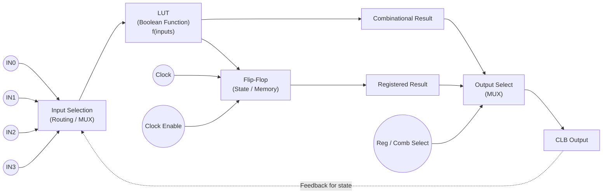

# Simulate a CLB using 74HCs discrete components

Show a practical, hands-on way to **simulate and prototype a single CLB (Configurable Logic Block)** using discrete 74HC-family ICs (and a few small helpers). Cover the CLB building blocks, a concrete 4-input LUT + FF example, how to make the configuration programmable, how to simulate (digital and analog/SPICE), wiring & timing tips, and a short BOM + test checklist so you can actually build and measure it.

---

## 1) What a CLB really is (functional parts)

A CLB in an FPGA typically contains:

* a small **LUT** (look-up table) implementing a combinational function,
* a **register/flip-flop** (D FF) for synchronous logic,
* local **routing/switches** to select inputs & route outputs,
* optional **carry logic** for arithmetic (not required for a basic CLB),
* **configuration memory** holding LUT truth table + routing bits.

We’ll mimic each with discrete ICs.

---

## 2) Parts (recommended 74HC / CMOS components)

Use HC family because it’s fast and available. Useful chips:

* **LUT / multiplexer**

  * `74HC151` — 8-to-1 data selector (good building block)
  * `74HC153` — dual 4-to-1 mux (if you want two small muxes)
  * `74HC157` — quad 2-to-1 mux (for combining levels)

* **Flip-flop / registers**

  * `74HC74` — dual D-type edge-triggered FF (setup/hold realistic)
  * `74HC273` / `74HC574` — octal D-latches (for configuration latches)

* **Programmable switches / routing**

  * `74HC4066` — 4 bilateral analog switches (use to implement programmable connections)
  * `74HC125` — tri-state buffers for output enabling

* **Configuration storage / loader**

  * `74HC595` — serial-in / parallel-out shift register (load LUT bits)
  * small DIP switches or jumpers (for static experiments)

* **Helpers**

  * `74HC00`, `74HC08`, `74HC32`, `74HC86` for gates if you want custom glue logic
  * 0.1 µF decoupling caps, 10k pull-ups/pull-downs as needed

---

## 3) Concrete example: build a *4-input LUT + D-FF* CLB

Goal: a CLB that takes 4 inputs (A,B,C,D), implements any 4-input boolean function (16 truth bits), optionally registers result on clock.

### a) How to implement 4-input LUT with HC parts

A 4-input LUT is a 16→1 lookup. Using widely available parts:

* Use **two `74HC151` (8:1)** muxes to cover inputs `I0..I7` and `I8..I15`.
* Use a **2:1 mux** (e.g., one section of `74HC157`) to select between the outputs of the two `74HC151`s.
* The LUT truth bits (16 bits) are presented to the data inputs of the two 151s. These 16 bits can be:

  * hardwired with resistors + toggle DIP switches for experiment, or
  * connected to outputs of two `74HC595` shift-registers so you can reprogram LUT serially.

Addressing scheme:

* Tie LUT select lines S0,S1,S2 (from `74HC151`) to three of the function inputs (say A,B,C).
* Use D (MSB) to select which 8:1 mux to use (it chooses between lower 8 and upper 8 via the final 2:1 mux).

This gives a reprogrammable 4-input LUT.

### b) D Flip-Flop

* Feed the LUT output into a D input of `74HC74` (use one FF).
* A clock input (global) clocks the `74HC74` (observe setup/hold).
* Use reset/enable as needed (tie asynchronous pins to safe levels).

### c) Routing / switch fabric (local)

* Use `74HC4066` bilateral switches to implement programmable local routing nodes:

  * each `4066` switch connects or disconnects a wire (e.g., connect LUT input to A or to an alternate net).
  * control the gate with configuration bits (from a `74HC273` latch loaded by a microcontroller or `74HC595`).

Alternatively, use `74HC125` tri-state buffers as one-way programmable connections.

### d) Putting it together (block flow)

```
Inputs A,B,C,D  ---> address & routing fabric ---> LUT (two 74HC151 + 157) ---> optional buffer ---> D input of 74HC74  ---> Q output.
                           ^                        config bits from 74HC595/273
                           |
                     74HC4066 switches
```

---

## 4) How to make LUT bits & routing programmable

Two practical methods:

**A. DIP switches (quick, manual)**

* Wire each of the 16 LUT inputs to a SPDT toggle/DIP switch pulling to GND or Vcc. Good for manual experimentation.

**B. Serial-load configuration (practical & repeatable)**

* Chain two `74HC595` shift registers → they provide 16 outputs that feed the 151/151 data inputs.
* Have a small MCU (Arduino, ATTiny, Pi Pico) or manual clock to shift new configuration into the 595s. Latch them and the CLB changes function immediately.
* Use another chain of `74HC273` latches (loaded from MCU or parallel bus) to hold routing control bits for 4066 switches.

This replicates how FPGAs load a bitstream.

---

## 5) Simulation options (digital & analog)

Pick the scope you need: pure logic behavior or real electrical timing.

### Digital / logic-level simulation (easiest)

* **Logisim-evolution**, **DigitalJS**, or **CircuitVerse** — great for logic-level emulation. You can model muxes, flip-flops, and the LUT function, and create a GUI to toggle configuration bits. (These are event-driven and ignore analog details.)
* In such tools implement a 16-bit LUT block or build from mux primitives.

### Timing / analog modeling (SPICE)

* If you want realistic propagation delays, drive strength, and power, use **ngspice** (or LTspice):

  * find or create `SUBCKT` models for the 74HCxx chips (many vendors provide SPICE models).
  * Model `74HC151`, `74HC74`, `74HC4066`, etc.
  * Connect as in the schematic and run transient simulations to observe propagation delays, hazards, and rise/fall behavior.
* If you don’t have vendor models, you can approximate using gate-level CMOS transistor networks — but that’s more work.

### Mixed approach

* Use Logisim for functional debug + ngspice for a couple of timing corner cases (clock->Q, mux chain delay). Or run analog sim only for the critical path.

---

## 6) Practical wiring & prototyping tips

* **Decoupling:** 0.1 µF caps near each IC VCC-GND.
* **Power:** use stable 5 V (or 3.3 V if using HC at lower Vcc and verifying vendor ratings). `74HC` runs to 6V but specs differ. Use the same rails for all chips.
* **Unused inputs:** tie unused inputs to GND or VCC (do not leave floating).
* **Clock:** use a clean square wave (oscillator or MCU pin). Debounce buttons; mechanical switches on clock cause bouncing & metastability.
* **Grounding:** star ground, short wiring for high-speed nets.
* **Routing switches (4066):** watch for on-resistance (~tens of ohms) and analog behaviour — okay for logic levels but not for precision analog signals.
* **Test points & measurement:** put test pads for LUT inputs, LUT output, FF Q and clock. Use a scope or logic analyzer to measure propagation times.

---

## 7) Timing & functional caveats

* 74HC parts have **finite propagation delay** (tens of ns). If you cascade many muxes you can get significant delay and glitches.
* Multiplexer trees can produce **glitches** on input transitions — register the output or use hazard-free encoding if needed.
* **Setup / hold**: obey the `74HC74` datasheet; the LUT output must be stable for the required setup time before the clock edge. If you use asynchronous programming to change LUT bits while clocking, update sequencing matters.

---

## 8) Bill of materials (minimal)

* 2 × `74HC151` (8:1 mux)
* 1 × `74HC157` (2:1 combining mux) or another small mux (could use `HC00`+gates but 157 easier)
* 1 × `74HC74` (D FF)
* 1 × `74HC4066` (4 bilateral switches) — or more if you want more routing bits
* 2 × `74HC595` (for 16 LUT bits) — optional for serial config
* 1 × protoboard / breadboard, wires, 0.1 µF caps × 6, 10k resistors × 10, DIP switches (optional), MCU for programming (optional)
* Power supply (5 V) and scope/logic analyzer for testing.

---

## 9) Example step-by-step build (quick)

1. On breadboard, place the two `74HC151`s and hook VCC/GND and decoupling caps.
2. Hardwire 16 DIP switches to the 16 data inputs, with pull-downs to GND and DPST to Vcc. (This is your LUT memory.)
3. Connect A,B,C → select lines on both 74HC151s. Connect D → control the final 2:1 mux (`157`) select.
4. Combine the outputs of the two 151s via the `157` (or a small 2:1 mux). The `157` output is the LUT output.
5. Feed LUT output to D of `74HC74`. Feed a clock. Measure Q.
6. Add a `74HC4066` between external inputs and the LUT address lines (or between inputs and the mux select) and control the switches via toggles or latches to emulate routing config.
7. Verify that toggling DIP switches changes the function; clocking captures values into FF.

---

## 10) Suggested simulations to run

* Functional truth-table: verify that for a set of input vectors LUT output matches expected truth table.
* Clock->Q timing: simulate worst-case path through mux tree into FF, then measure t_pd + setup margin.
* Glitch test: toggle inputs quickly and look for transient pulses at LUT output. Verify FF eliminates them when clocked appropriately.

---

## 11) Example SPICE / ngspice tip (if you go that route)

* Get manufacturer `74HC151` and `74HC74` SPICE models (Nexperia, TI, etc. often publish).
* Use `.tran` simulation and probe `V(out)` and `V(Q)` while toggling inputs with PWL or pulse sources.
* Check propagation delays and simulate different VCC (5V vs 3.3V) for margins.

---

## 12) Next steps / extensions

* Add carry chain: replicate small minimal carry logic with `HC08` and fast routing for adders.
* Create a 2×2 CLB array and implement simple mapped logic across CLBs; experiment with a tiny place-and-route done manually.
* Replace DIP switches with MCU-driven `74HC595` chain for fast reprogramming and to emulate dynamic reconfiguration.


Execution-level view of what a CLB actually does, shown as data flowing through it, not a schematic.

This answers your question:

> “Taking input… translating to some language… doing logic/ALU… spitting result?”


---

🧠 CLB Function Flow (Mermaid)



---

🧩 How to read this diagram (step by step)

1️⃣ Inputs arrive

Signals from:

Other CLBs

IO pins

Feedback paths


arrive at the input routing MUX.


---

2️⃣ Input selection (routing)

The CLB does not take all inputs at once.

Instead:

Routing logic selects which signals feed the logic

This is how the FPGA fabric connects logic together


➡️ No “language translation” — just signal routing


---

3️⃣ LUT = programmable logic function

The LUT evaluates:

output = f(selected_inputs)

Examples:

AND, OR, XOR

Half-adder

Comparator

Small ALU slice

Control logic


➡️ This is where computation happens


---

4️⃣ Two possible paths

🟢 Combinational

Output changes immediately when inputs change

Used for pure logic


🔵 Sequential

Output stored in flip-flop

Changes only on clock edge

Used for state, counters, pipelines


---

5️⃣ Output selection

A MUX chooses:

Direct LUT result or

Registered (clocked) result


➡️ Same CLB can behave as:

Logic gate

Register

FSM element


---

6️⃣ Output & feedback

Result is driven onto routing fabric

Can feed other CLBs

Can feed itself → state machines


---

🧠 Mental Model (very important)

A CLB is NOT:

A CPU

An instruction executor

A “translator”


A CLB IS:

> A programmable Boolean function + optional memory


Think of it as:

> “A configurable logic neuron”


Thousands of them together form:

ALUs

CPUs

DSPs

SDRs

Ethernet MACs


---

🧪 Example: 1-bit ALU built from CLBs

CLB	Role

CLB 1	XOR → Sum
CLB 2	AND → Carry
CLB 3	Register sum
CLB 4	Register carry


➡️ Together: Adder ➡️ Replicated: ALU ➡️ With control: CPU


---

✅ Final Answer to Your Question

> Does a CLB take input, translate, do logic, and spit out result?


✔ Yes — but in hardware terms:

No language

No instructions

No execution

Only signal routing + Boolean evaluation + optional state


