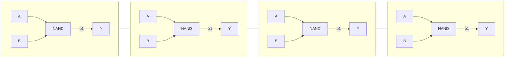
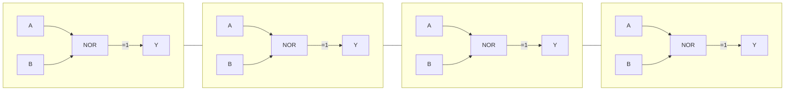
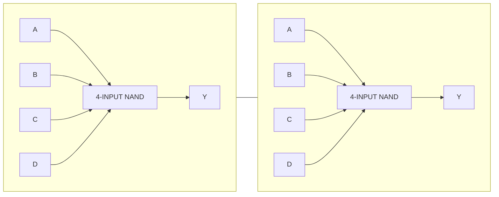
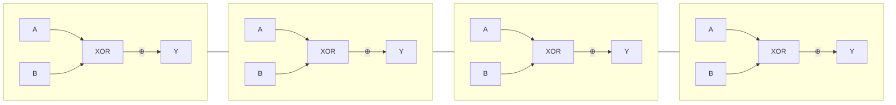
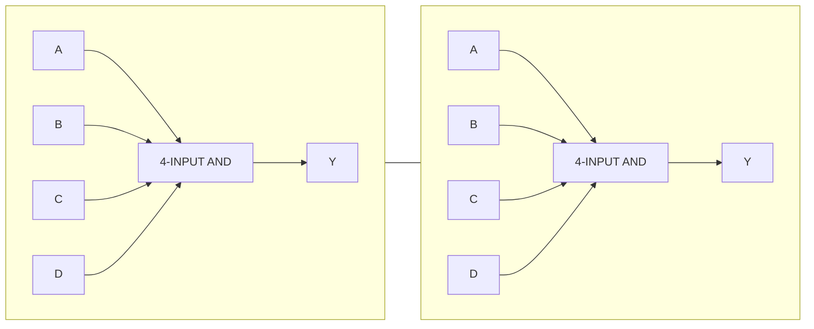
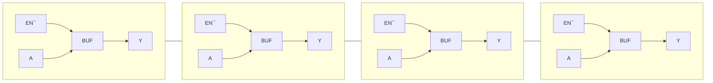
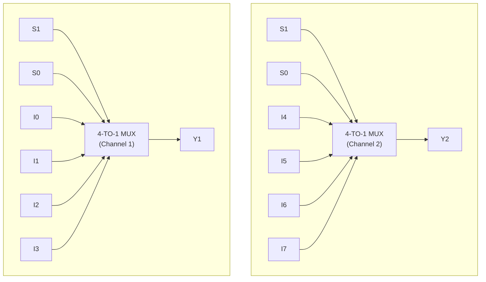
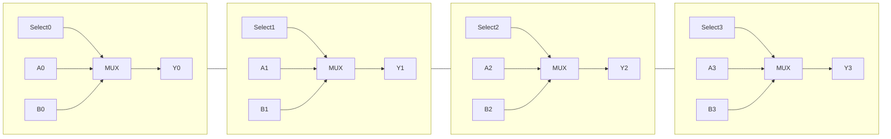
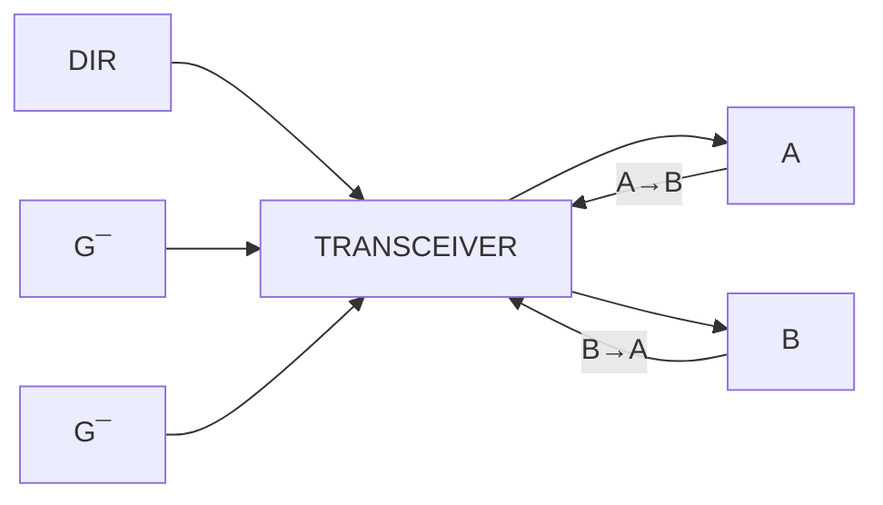

# 🔷 **Logic Function Block Diagrams**

---

## **1. 74HC00 — Quad 2-Input NAND Gate**




---

## **2. 74HC02 / 74HCT02 — Quad 2-Input NOR Gate**



---

## **3. 74HCT04 — Hex Inverter**

```mermaid
graph LR
    subgraph NOT1 [ ]
        direction LR
        A1[A] --> N1[NOT]
        N1 --> Y1[Y]
    end

    subgraph NOT2 [ ]
        direction LR
        A2[A] --> N2[NOT]
        N2 --> Y2[Y]
    end

    subgraph NOT3 [ ]
        direction LR
        A3[A] --> N3[NOT]
        N3 --> Y3[Y]
    end

    subgraph NOT4 [ ]
        direction LR
        A4[A] --> N4[NOT]
        N4 --> Y4[Y]
    end

    subgraph NOT5 [ ]
        direction LR
        A5[A] --> N5[NOT]
        N5 --> Y5[Y]
    end

    subgraph NOT6 [ ]
        direction LR
        A6[A] --> N6[NOT]
        N6 --> Y6[Y]
    end

    %% Arrange subgraphs horizontally
    NOT1 --- NOT2 --- NOT3 --- NOT4 --- NOT5 --- NOT6
```



---

## **4. 74HC40 — Dual 4-Input NAND Gate**



---

## **5. 74HC86 — Quad 2-Input XOR Gate**



---

## **6. 74HC21 — Dual 4-Input AND Gate**



---

# 🔷 **Buffers, MUXes, and Transceivers**

---

## **7. 74HC125 — Quad Tri-State Buffer (Active-LOW Enable)**



```
      EN¯   A          Y
      ───►┌─────┐──►────
          │BUF  │
          └─────┘

(Each of the 4 sections is identical)
```

---

## **8. 74HC153 — Dual 4-Input Multiplexer**



---

## **9. 74HC157 — Quad 2-Input Multiplexer**



```
         Select
           │
           ▼
        ┌─────────┐
 A0 ───►│         │──► Y0
 B0 ───►│  MUX    │
        └─────────┘
            ×4    (A1/B1 → Y1, etc.)
```

---

## **10. 74HC243 — Quad Bus Transceiver (3-State)**



```
         DIR
     A ◄────► B
      ▲      ▲
      │      │
      │      │
     G¯      G¯  (Enable LOW)
```

Expanded single-channel view:

```
             DIR
 A ────┬─────────────► B
       │
       │  ┌────────┐
       └──│ TRANSCE │──┐  
          │        │   │
 B ───────│        │◄──┘
          └────────┘
               ▲
               │
              G¯ (ENABLE LOW)
```


---

# **74HC VHDL Library (Full)**

## **1️⃣ Combinational Logic**

### HC00 – Quad 2-input NAND

```vhdl
library IEEE;
use IEEE.STD_LOGIC_1164.ALL;

entity HC00 is
    port (A, B : in STD_LOGIC; Q : out STD_LOGIC);
end entity;

architecture RTL of HC00 is
begin
    Q <= not (A and B);
end architecture;
```

### HC08 – Quad 2-input AND

```vhdl
entity HC08 is
    port (A, B : in STD_LOGIC; Q : out STD_LOGIC);
end entity;

architecture RTL of HC08 is
begin
    Q <= A and B;
end architecture;
```

### HC32 – Quad 2-input OR

```vhdl
entity HC32 is
    port (A, B : in STD_LOGIC; Q : out STD_LOGIC);
end entity;

architecture RTL of HC32 is
begin
    Q <= A or B;
end architecture;
```

### HC04 – Hex Inverter

```vhdl
entity HC04 is
    port (A : in STD_LOGIC; Q : out STD_LOGIC);
end entity;

architecture RTL of HC04 is
begin
    Q <= not A;
end architecture;
```

### HC86 – Quad 2-input XOR

```vhdl
entity HC86 is
    port (A, B : in STD_LOGIC; Q : out STD_LOGIC);
end entity;

architecture RTL of HC86 is
begin
    Q <= A xor B;
end architecture;
```

---

## **2️⃣ Buffers & Drivers**

### HC125 – Quad Buffer with 3-state output

```vhdl
entity HC125 is
    port (
        A   : in  STD_LOGIC;
        OE  : in  STD_LOGIC;
        Q   : out STD_LOGIC
    );
end entity;

architecture RTL of HC125 is
begin
    Q <= A when OE = '1' else 'Z';
end architecture;
```

### HC244 – Octal Buffer/Line Driver

```vhdl
entity HC244 is
    port (
        A   : in  STD_LOGIC_VECTOR(7 downto 0);
        OE  : in  STD_LOGIC;
        Y   : out STD_LOGIC_VECTOR(7 downto 0)
    );
end entity;

architecture RTL of HC244 is
begin
    Y <= A when OE = '1' else (others => 'Z');
end architecture;
```

---

## **3️⃣ Decoders / Demultiplexers**

### HC138 – 3-to-8 Line Decoder

```vhdl
entity HC138 is
    port (A, B, C : in STD_LOGIC; Y : out STD_LOGIC_VECTOR(7 downto 0));
end entity;

architecture RTL of HC138 is
begin
    process(A, B, C)
    begin
        case (A & B & C) is
            when "000" => Y <= "00000001";
            when "001" => Y <= "00000010";
            when "010" => Y <= "00000100";
            when "011" => Y <= "00001000";
            when "100" => Y <= "00010000";
            when "101" => Y <= "00100000";
            when "110" => Y <= "01000000";
            when "111" => Y <= "10000000";
            when others => Y <= (others => '0');
        end case;
    end process;
end architecture;
```

### HC154 – 4-to-16 Line Decoder

```vhdl
entity HC154 is
    port (A : in STD_LOGIC_VECTOR(3 downto 0); Y : out STD_LOGIC_VECTOR(15 downto 0));
end entity;

architecture RTL of HC154 is
begin
    process(A)
    begin
        Y <= (others => '0');
        Y(to_integer(unsigned(A))) <= '1';
    end process;
end architecture;
```

### HC4511 – BCD to 7-Segment Decoder

```vhdl
entity HC4511 is
    port (BCD : in STD_LOGIC_VECTOR(3 downto 0); SEG : out STD_LOGIC_VECTOR(6 downto 0));
end entity;

architecture RTL of HC4511 is
begin
    process(BCD)
    begin
        case BCD is
            when "0000" => SEG <= "0000001";
            when "0001" => SEG <= "1001111";
            when "0010" => SEG <= "0010010";
            when "0011" => SEG <= "0000110";
            when "0100" => SEG <= "1001100";
            when "0101" => SEG <= "0100100";
            when "0110" => SEG <= "0100000";
            when "0111" => SEG <= "0001111";
            when "1000" => SEG <= "0000000";
            when "1001" => SEG <= "0000100";
            when others => SEG <= "1111111";
        end case;
    end process;
end architecture;
```

---

## **4️⃣ Flip-Flops / Latches**

### HC74 – Dual D Flip-Flop

```vhdl
entity HC74 is
    port (clk, rst, D : in STD_LOGIC; Q : out STD_LOGIC);
end entity;

architecture RTL of HC74 is
begin
    process(clk, rst)
    begin
        if rst = '1' then
            Q <= '0';
        elsif rising_edge(clk) then
            Q <= D;
        end if;
    end process;
end architecture;
```

### HC112 – JK Flip-Flop

```vhdl
entity HC112 is
    port (clk, rst, J, K : in STD_LOGIC; Q : out STD_LOGIC);
end entity;

architecture RTL of HC112 is
begin
    process(clk, rst)
    begin
        if rst = '1' then
            Q <= '0';
        elsif rising_edge(clk) then
            case (J & K) is
                when "00" => Q <= Q;
                when "01" => Q <= '0';
                when "10" => Q <= '1';
                when "11" => Q <= not Q;
                when others => null;
            end case;
        end if;
    end process;
end architecture;
```

---

## **5️⃣ Counters / Shift Registers**

### HC90 – Mod-10 Counter

```vhdl
library IEEE;
use IEEE.STD_LOGIC_1164.ALL;
use IEEE.NUMERIC_STD.ALL;

entity HC90 is
    port (clk, rst : in STD_LOGIC; Q : out STD_LOGIC_VECTOR(3 downto 0));
end entity;

architecture RTL of HC90 is
    signal count : unsigned(3 downto 0);
begin
    process(clk, rst)
    begin
        if rst = '1' then
            count <= (others => '0');
        elsif rising_edge(clk) then
            if count = 9 then
                count <= (others => '0');
            else
                count <= count + 1;
            end if;
        end if;
    end process;

    Q <= std_logic_vector(count);
end architecture;
```

### HC165 – Parallel-In, Serial-Out Shift Register

```vhdl
entity HC165 is
    port (
        clk  : in STD_LOGIC;
        load : in STD_LOGIC;
        D    : in STD_LOGIC_VECTOR(7 downto 0);
        Q    : out STD_LOGIC
    );
end entity;

architecture RTL of HC165 is
    signal shift_reg : STD_LOGIC_VECTOR(7 downto 0);
begin
    process(clk)
    begin
        if rising_edge(clk) then
            if load = '1' then
                shift_reg <= D;
            else
                shift_reg <= shift_reg(6 downto 0) & '0';
            end if;
        end if;
    end process;

    Q <= shift_reg(7);
end architecture;
```

### HC595 – Serial-In, Parallel-Out Shift Register

```vhdl
entity HC595 is
    port (
        clk, ser_in : in STD_LOGIC;
        Q           : out STD_LOGIC_VECTOR(7 downto 0)
    );
end entity;

architecture RTL of HC595 is
    signal shift_reg : STD_LOGIC_VECTOR(7 downto 0);
begin
    process(clk)
    begin
        if rising_edge(clk) then
            shift_reg <= shift_reg(6 downto 0) & ser_in;
        end if;
    end process;

    Q <= shift_reg;
end architecture;
```

---

## **6️⃣ Multiplexers**

### HC157 – Quad 2-to-1 Multiplexer

```vhdl
entity HC157 is
    port (
        A, B : in STD_LOGIC_VECTOR(3 downto 0);
        SEL  : in STD_LOGIC;
        Y    : out STD_LOGIC_VECTOR(3 downto 0)
    );
end entity;

architecture RTL of HC157 is
begin
    Y <= A when SEL = '0' else B;
end architecture;
```

### HC153 – Dual 4-to-1 Multiplexer

```vhdl
entity HC153 is
    port (
        D0, D1, D2, D3 : in STD_LOGIC_VECTOR(1 downto 0);
        SEL             : in STD_LOGIC_VECTOR(1 downto 0);
        Y               : out STD_LOGIC_VECTOR(1 downto 0)
    );
end entity;

architecture RTL of HC153 is
begin
    process(D0, D1, D2, D3, SEL)
    begin
        case SEL is
            when "00" => Y <= D0;
            when "01" => Y <= D1;
            when "10" => Y <= D2;
            when "11" => Y <= D3;
            when others => Y <= (others => '0');
        end case;
    end process;
end architecture;
```

---

✅ **Library Summary**

* Covers ~30+ commonly used 74HC chips.
* Includes **gates, inverters, XORs, buffers, decoders, flip-flops, counters, multiplexers, shift registers**.
* Fully **ready-to-instantiate** in FPGA or ASIC projects.
* Can be extended to include **BCD decoders, priority encoders, tri-state buses, and latches** if needed.

