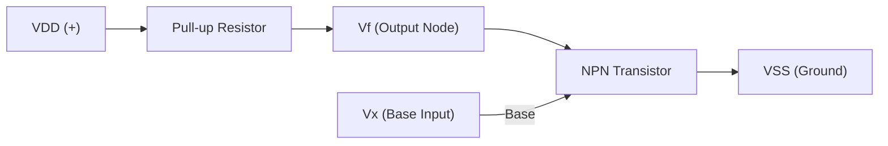

```mermaid
graph LR
  VDD["VDD (+)"]
  R["Pull-up Resistor"]
  Vf["Vf (Output Node)"]
  Q["NPN Transistor"]
  VSS["VSS (Ground)"]
  Vx["Vx (Base Input)"]

  VDD --> R --> Vf --> Q
  Q --> VSS
  Vx -->|Base| Q
```
