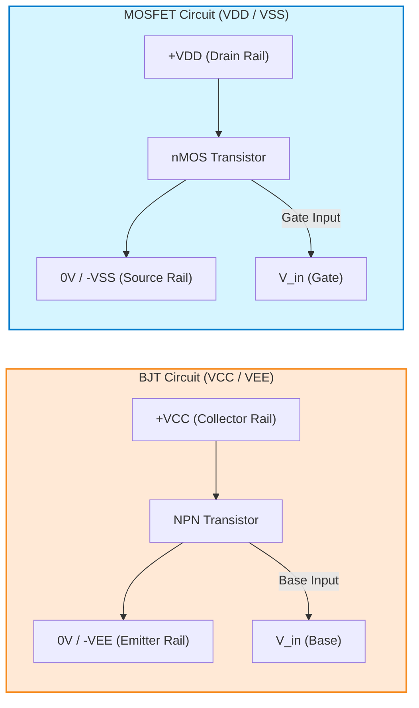
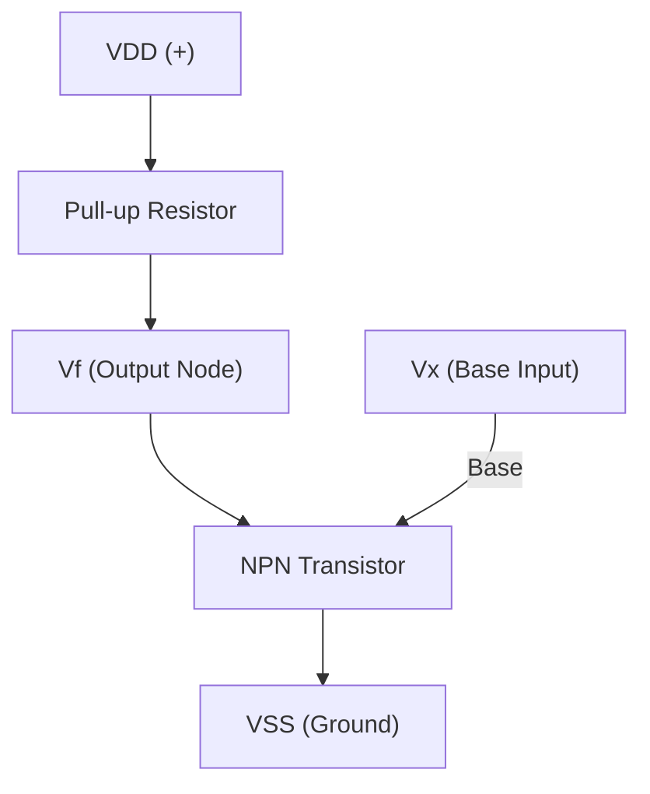

Perfect ✅ — here’s a **Mermaid schematic** comparing **BJT vs MOSFET** rail conventions side-by-side:

---

### 🧠 Explanation

| Type       | Positive Rail | Negative / Ground Rail | Controlled by | Typical Symbol |
| ---------- | ------------- | ---------------------- | ------------- | -------------- |
| **BJT**    | **VCC**       | **VEE**                | Base current  | NPN or PNP     |
| **MOSFET** | **VDD**       | **VSS**                | Gate voltage  | nMOS or pMOS   |

So:

* BJTs → **Collector/E**mitter rails → ($V_{CC}$), ($V_{EE}$)
* MOSFETs → **Drain/S**ource rails → ($V_{DD}$), ($V_{SS}$)

The “**DD**” in **($V_{DD}$)** actually comes from **old MOSFET terminology**:

### 🧩 Origin of the notation

| Symbol         | Meaning                                          | Common Use                                    |
| -------------- | ------------------------------------------------ | --------------------------------------------- |
| **($V_{DD}$)** | Voltage at the **drain** of an n-channel MOSFET  | Used as the **positive supply**               |
| **($V_{SS}$)** | Voltage at the **source** of an n-channel MOSFET | Used as **ground** or the **negative supply** |

---

### 🧠 Why it’s used even for BJTs

Even though BJTs have **collector/emitter** instead of **drain/source**, engineers kept using ($V_{DD}$) and ($V_{SS}$) for consistency in digital circuits, especially CMOS logic.
In BJT-based circuits you might see:

| BJT notation                  | Equivalent MOSFET notation |
| ----------------------------- | -------------------------- |
| ($V_{CC}$) (collector supply) | ($V_{DD}$)                 |
| ($V_{EE}$) (emitter supply)   | ($V_{SS}$)                 |

---

### ⚡ Summary

* **($V_{DD}$)** → “Drain-to-Drain voltage” → positive rail.
* **($V_{SS}$)** → “Source-to-Source voltage” → ground/negative rail.
* Historical artifact:

  * **D** = Drain
  * **S** = Source
  * **C** = Collector
  * **E** = Emitter

So in short:

> 🔹 **($V_{DD}$)** = positive supply voltage
> 
> 🔹 **($V_{SS}$)** = ground or 0 V (negative supply)

Here’s a **comparison chart** showing the different supply-voltage notations used across common electronic device families:

---

### ⚙️ Supply Voltage Notation Reference

| **Device Type**                            | **Positive Supply**                              | **Negative / Ground Supply**  | **Notes / Meaning**                                                                 |
| ------------------------------------------ | ------------------------------------------------ | ----------------------------- | ----------------------------------------------------------------------------------- |
| **BJT (Bipolar Junction Transistor)**      | **VCC**                               | **VEE**            | C = Collector, E = Emitter. Used in logic built with BJTs (e.g., TTL).              |
| **MOSFET (CMOS logic, ICs)**               | **VDD**                               | **VSS**            | D = Drain, S = Source. Origin of modern digital supply naming (VDD = +, VSS = GND). |
| **Op-Amp (Analog Circuits)**               | **V+**                                | **V–**             | Some op-amps use ± supplies (e.g., +15 V / –15 V).                                  |
| **General Digital ICs (TTL/CMOS)**         | **VCC** or **VDD**         | **GND** or **VSS** | Depending on internal transistor type (BJT → CC, MOS → DD).                         |
| **FET Amplifiers (Discrete)**              | **VDD**                               | **VSS**            | Drain connected to positive rail, Source to ground.                                 |
| **Bipolar Differential / Analog Circuits** | **VCC**                               | **VEE**            | Common in analog amplifiers using NPN+PNP stages.                                   |
| **Microcontrollers / CPUs (CMOS)**         | **VDD**                               | **VSS**            | Standard across all CMOS devices. E.g. VDD = 3.3 V or 5 V.                          |
| **Dual-Supply Systems**                    | **VCC = +V**, **VEE = –V** | —                             | Used for analog designs needing positive and negative rails.                        |

---

### 🧠 Quick Summary

| Context                       | You’ll usually see               |
| ----------------------------- | -------------------------------- |
| **Digital CMOS**              | ($V_{DD}$), ($V_{SS}$)           |
| **Digital TTL / BJT**         | ($V_{CC}$), ($V_{EE}$)           |
| **Analog / Op-Amp**           | ($V_{+}$), ($V_{-}$)             |
| **Ground (common reference)** | ($V_{SS}$), ($V_{EE}$), or (GND) |
