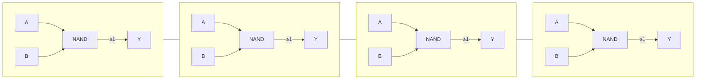

Below are **clean, readable ASCII-style block diagrams** for every part in your inventory.
These mimic the diagrams found in TI/Nexperia datasheets and are suitable for quick reference or documentation.

---

# 🔷 **Logic Function Block Diagrams**

---

## **1. 74HC00 — Quad 2-Input NAND Gate**




---

## **2. 74HC02 / 74HCT02 — Quad 2-Input NOR Gate**

```
      _______          _______          _______          _______
 A --|     =1|-- Y   A --|     =1|-- Y   A --|     =1|-- Y   A --|     =1|-- Y
 B --|       |       B --|       |       B --|       |       B --|       |
     |  NOR  |           |  NOR  |           |  NOR  |           |  NOR  |
     |_______|           |_______|           |_______|           |_______|
```

---

## **3. 74HCT04 — Hex Inverter**

```
 A ──►┌───────┐──► Y
      │ NOT   │
      └───────┘  ×6
```

---

## **4. 74HC40 — Dual 4-Input NAND Gate**

```
      ______________________           ______________________
 A --|                      |-- Y   A --|                      |-- Y
 B --|                      |         B --|                      |
 C --|      4-INPUT NAND    |         C --|      4-INPUT NAND    |
 D --|______________________|         D --|______________________|
```

---

## **5. 74HC86 — Quad 2-Input XOR Gate**

```
      _______          _______          _______          _______
 A --|      ⊕|-- Y   A --|      ⊕|-- Y   A --|      ⊕|-- Y   A --|      ⊕|-- Y
 B --|       |       B --|       |       B --|       |       B --|       |
     |  XOR  |           |  XOR  |           |  XOR  |           |  XOR  |
     |_______|           |_______|           |_______|           |_______|
```

---

## **6. 74HC21 — Dual 4-Input AND Gate**

```
      ______________________           ______________________
 A --|                      |-- Y   A --|                      |-- Y
 B --|                      |         B --|                      |
 C --|      4-INPUT AND     |         C --|      4-INPUT AND     |
 D --|______________________|         D --|______________________|
```

---

# 🔷 **Buffers, MUXes, and Transceivers**

---

## **7. 74HC125 — Quad Tri-State Buffer (Active-LOW Enable)**

```
      EN¯   A          Y
      ───►┌─────┐──►────
          │BUF  │
          └─────┘

(Each of the 4 sections is identical)
```

---

## **8. 74HC153 — Dual 4-Input Multiplexer**

```
          ┌────────────────────┐
 S1 ─────►│                    │
 S0 ─────►│     4-TO-1 MUX     │──► Y1
 I0 ─────►│     (Channel 1)    │
 I1 ─────►│                    │
 I2 ─────►│                    │
 I3 ─────►│                    │
          └────────────────────┘

          ┌────────────────────┐
 S1 ─────►│                    │
 S0 ─────►│     4-TO-1 MUX     │──► Y2
 I4 ─────►│     (Channel 2)    │
 I5 ─────►│                    │
 I6 ─────►│                    │
 I7 ─────►│                    │
          └────────────────────┘
```

---

## **9. 74HC157 — Quad 2-Input Multiplexer**

```
         Select
           │
           ▼
        ┌─────────┐
 A0 ───►│         │──► Y0
 B0 ───►│  MUX    │
        └─────────┘
            ×4    (A1/B1 → Y1, etc.)
```

---

## **10. 74HC243 — Quad Bus Transceiver (3-State)**

```
         DIR
     A ◄────► B
      ▲      ▲
      │      │
      │      │
     G¯      G¯  (Enable LOW)
```

Expanded single-channel view:

```
             DIR
 A ────┬─────────────► B
       │
       │  ┌────────┐
       └──│ TRANSCE │──┐  
          │        │   │
 B ───────│        │◄──┘
          └────────┘
               ▲
               │
              G¯ (ENABLE LOW)
```

---

If you want, I can also generate:

✅ **High-resolution PNG schematics**
✅ **SVG symbols for KiCad / EasyEDA**
✅ **Combined “logic crib sheet” PDF**
