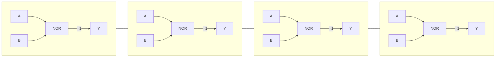
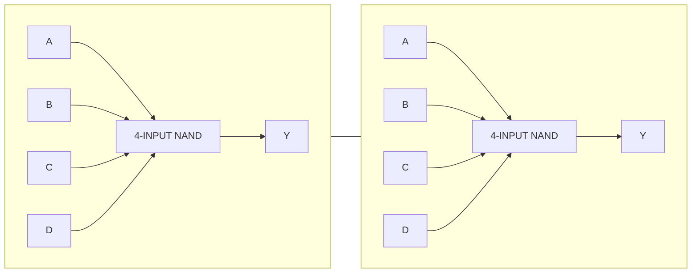
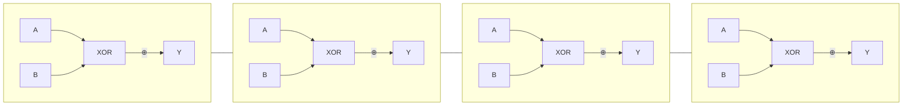
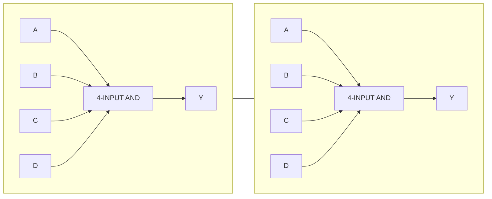
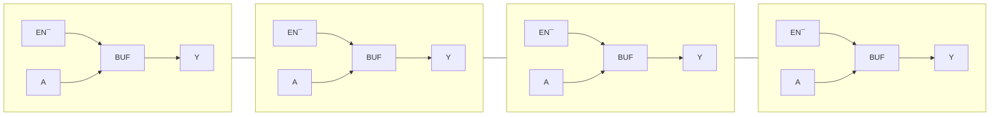
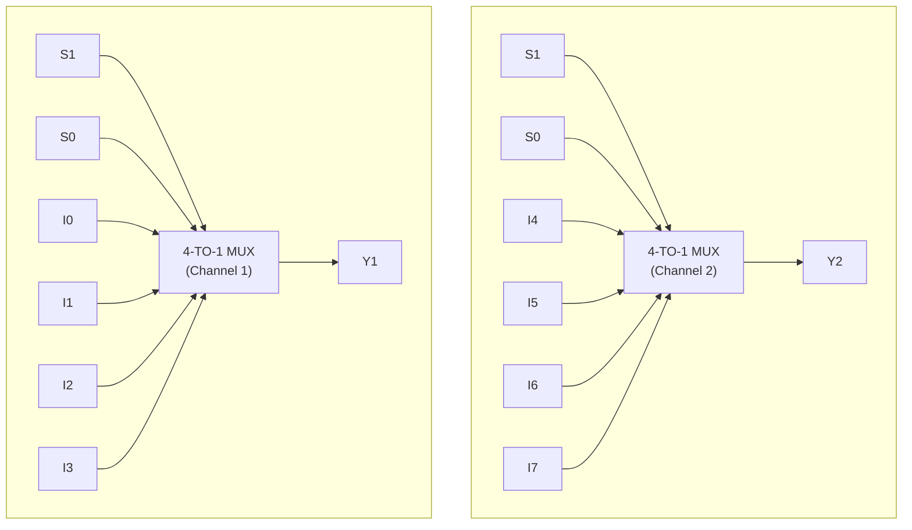
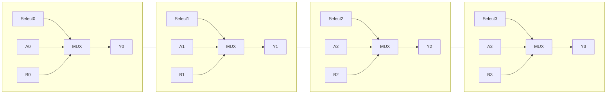
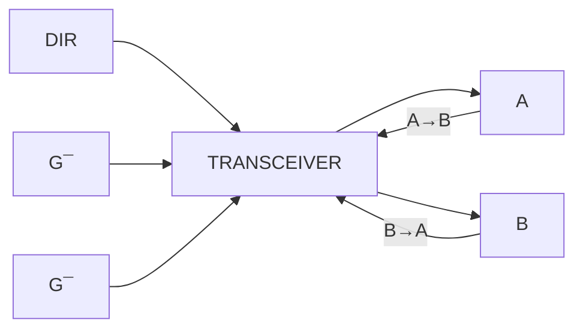

# 🔷 **Logic Function Block Diagrams**

---

## **1. 74HC00 — Quad 2-Input NAND Gate**


---

## **2. 74HC02 / 74HCT02 — Quad 2-Input NOR Gate**



---

## **3. 74HCT04 — Hex Inverter**

```mermaid
graph LR
    subgraph NOT1 [ ]
        direction LR
        A1[A] --> N1[NOT]
        N1 --> Y1[Y]
    end

    subgraph NOT2 [ ]
        direction LR
        A2[A] --> N2[NOT]
        N2 --> Y2[Y]
    end

    subgraph NOT3 [ ]
        direction LR
        A3[A] --> N3[NOT]
        N3 --> Y3[Y]
    end

    subgraph NOT4 [ ]
        direction LR
        A4[A] --> N4[NOT]
        N4 --> Y4[Y]
    end

    subgraph NOT5 [ ]
        direction LR
        A5[A] --> N5[NOT]
        N5 --> Y5[Y]
    end

    subgraph NOT6 [ ]
        direction LR
        A6[A] --> N6[NOT]
        N6 --> Y6[Y]
    end

    %% Arrange subgraphs horizontally
    NOT1 --- NOT2 --- NOT3 --- NOT4 --- NOT5 --- NOT6
```



---

## **4. 74HC40 — Dual 4-Input NAND Gate**



---

## **5. 74HC86 — Quad 2-Input XOR Gate**



---

## **6. 74HC21 — Dual 4-Input AND Gate**



---

# 🔷 **Buffers, MUXes, and Transceivers**

---

## **7. 74HC125 — Quad Tri-State Buffer (Active-LOW Enable)**



```
      EN¯   A          Y
      ───►┌─────┐──►────
          │BUF  │
          └─────┘

(Each of the 4 sections is identical)
```

---

## **8. 74HC153 — Dual 4-Input Multiplexer**



---

## **9. 74HC157 — Quad 2-Input Multiplexer**



```
         Select
           │
           ▼
        ┌─────────┐
 A0 ───►│         │──► Y0
 B0 ───►│  MUX    │
        └─────────┘
            ×4    (A1/B1 → Y1, etc.)
```

---

## **10. 74HC243 — Quad Bus Transceiver (3-State)**



```
         DIR
     A ◄────► B
      ▲      ▲
      │      │
      │      │
     G¯      G¯  (Enable LOW)
```

Expanded single-channel view:

```
             DIR
 A ────┬─────────────► B
       │
       │  ┌────────┐
       └──│ TRANSCE │──┐  
          │        │   │
 B ───────│        │◄──┘
          └────────┘
               ▲
               │
              G¯ (ENABLE LOW)
```


---

