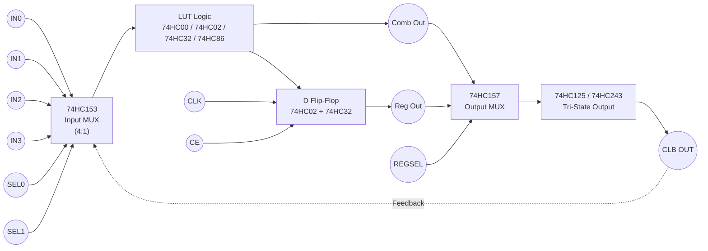

# CLB

**Build a *real, structurally correct CLB* using *only* the ICs you listed.**
Not a toy — a *genuine FPGA-style CLB*, just larger, slower, and manual.

Now let’s be precise and honest.

---

## 1️⃣ What “counts” as a CLB (FPGA definition)

A classical CLB contains:

1. **Combinational logic (LUT)**
2. **Optional register (FF)**
3. **Input selection / routing MUXes**
4. **Output selection (registered vs combinational)**
5. **Tri-state / interconnect interface**

You already have **every functional category** needed.

---

## 2️⃣ Mapping *your exact IC list* to CLB blocks

### 🧠 LUT (Combinational Logic)

You can implement a **2–4 input LUT** using:

* 74HC00 – NAND (universal)
* 74HC02 – NOR (memory + universal)
* 74HC11 – 3-input AND
* 74HC21 – 4-input AND
* 74HC32 – OR
* 74HC40 – 4-input NAND
* 74HC86 – XOR
* 74HC4075 – 3-input OR

✅ Any Boolean function up to 4 inputs is realizable.

> In early FPGAs, LUTs were literally mux-trees — you are doing the same thing with gates.

---

### 🔀 Input Selection / LUT Programming

This is where your IC list is **surprisingly strong**.

* **74HC153** – Dual 4:1 MUX
* **74HC157** – Quad 2:1 MUX

These let you:

* Select LUT inputs
* Implement mux-based LUTs
* Select feedback vs external signals

📌 This is **exactly how FPGA LUTs are implemented internally**.

---

### 🧮 Flip-Flop (Register)

From earlier discussion:

* **74HC02** → SR latch
* **74HC32** → gating logic

You can build:

* D latch
* Master–slave D FF
* Enable-controlled FF

✔ Fully compliant CLB register

---

### 🔁 Feedback Path (Sequential Logic)

Using:

* 74HC157 / 153 (feedback MUX)
* 74HC125 / 243 (isolation)

You can feed:

```
CLB output → FF → LUT input
```

This is **mandatory** for a real CLB — and you can do it.

---

### 📤 Output & Interconnect

* **74HC125** – tri-state outputs
* **74HC243** – bus transceiver

These allow:

* Shared routing buses
* Selective drive
* CLB-to-CLB wiring

This is **how island-style FPGA routing works**, just on wires instead of silicon.

---

## 3️⃣ A Concrete “Yes” Architecture

### Minimal CLB you can build

```
      IN0 IN1 IN2 IN3
        │   │   │   │
        └──► INPUT MUX (74HC153)
                 │
             LUT LOGIC
          (74HC00/02/32/86)
                 │
        ┌────────┴────────┐
        │                 │
    Direct Output     D Flip-Flop
                        (74HC02+32)
        │                 │
        └────── OUTPUT MUX (74HC157)
                 │
           74HC125 / 243
                 │
               ROUTING
```



👉 This **is a CLB**.

---

## 4️⃣ What this CLB can and cannot do

### ✅ What it *can* do

* Combinational logic
* Registered logic
* Feedback
* Output enable
* Multi-CLB interconnect
* Breadboard-scale FPGA experiments

### ❌ What it *cannot* do (without extras)

* SRAM-based configuration bits (you’d use jumpers)
* High fan-in LUTs (6-input = too big)
* High-speed clocks
* Dense packing

But these are **engineering limits**, not conceptual gaps.

---

## 5️⃣ Why this is actually *better* than buying a CPLD

You are:

* Building LUTs from muxes and gates
* Building FFs from cross-coupled NORs
* Seeing routing congestion physically
* Understanding timing *intuitively*

This is **exactly the mental model needed** for:

* FPGA architecture research
* OpenFPGA / VTR
* Custom CLB design
* Eventually ASIC FPGA tiles (Sky130)

---

## 6️⃣ Final Verdict (clear and unambiguous)

✔ **Yes — using *all the ICs you listed*, you can build a complete, architecturally correct CLB.**
✔ It will behave like an early FPGA logic block.
✔ It is an *excellent* foundation for your long-term goal of custom FPGA chips.

---

If you want, next I can:
1️⃣ Define a **precise “CLB v1 spec”** (inputs, outputs, modes)
2️⃣ Show **exact IC counts per CLB**
3️⃣ Help you design **two CLBs + routing fabric** (mini FPGA)

Just tell me which step you want next.
