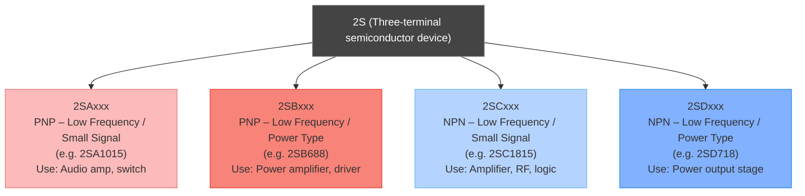

# **Japanese transistor numbering system (JIS standard)**

### 🧩 The “2S” Prefix

In Japanese transistor part numbers like **2SA**, **2SB**, **2SC**, etc.,
the **“2S”** means it’s a **semiconductor device** — specifically a **three-terminal transistor** (two for a diode would be “1S”).

 </img>


---

### ⚙️ Breakdown of the Code

| Example    | Type       | Polarity / Usage                           | Typical Package     |
| ---------- | ---------- | ------------------------------------------ | ------------------- |
| **2SAxxx** | Transistor | **PNP** (low-frequency or general-purpose) | TO-92, TO-126, etc. |
| **2SBxxx** | Transistor | **PNP** (power type)                       | TO-220, TO-3P, etc. |
| **2SCxxx** | Transistor | **NPN** (low-frequency or general-purpose) | TO-92, TO-126, etc. |
| **2SDxxx** | Transistor | **NPN** (power type)                       | TO-220, TO-3P, etc. |

---

### 🧠 Meaning of Each Part

* **2S** → Indicates a transistor device.
* **A/B/C/D** → Letter group that identifies **polarity** and **frequency/power class**.
* **xxx** → Number assigned by manufacturer.

So:

* **2SA → PNP small-signal transistor**
* **2SB → PNP power transistor**
* **2SC → NPN small-signal transistor**
* **2SD → NPN power transistor**

---

### 🧰 Example Parts

| Part    | Type | Description                          |
| ------- | ---- | ------------------------------------ |
| 2SA1015 | PNP  | Low-noise amplifier transistor       |
| 2SC1815 | NPN  | General-purpose amplifier transistor |
| 2SB688  | PNP  | Audio power transistor               |
| 2SD718  | NPN  | Audio power transistor               |

---

So at your electronics store:

* **2SA shelf** = PNP transistors (signal type)
* **2SB Resistors** (probably a labeling mistake — should be “2SB Transistors”) = PNP power transistors
* **2SC shelf** = NPN transistors (signal type)

Here’s a clear visual chart showing how the **Japanese transistor classification (2SA–2SD)** system works 👇



🧠 **Quick memory tip:**

* **A/B = PNP**
* **C/D = NPN**
* **Odd (A, C)** = small-signal
* **Even (B, D)** = power

---

The kind of comparison that helps you “read” transistor part numbers across standards. Let’s go step-by-step 👇

---

## 🧩 1️⃣ Naming Systems Overview

| Origin                            | Typical Prefix        | Example      | Description                                   |
| --------------------------------- | --------------------- | ------------ | --------------------------------------------- |
| 🇯🇵 **Japanese (JIS)**           | 2SA / 2SB / 2SC / 2SD | 2SC1815      | 2S = 3-terminal device, A/B = PNP, C/D = NPN  |
| 🇺🇸 **American (JEDEC)**         | 2Nxxxx                | 2N3904       | 2N = 2-junction transistor                    |
| 🇪🇺 **European (Pro Electron)**  | BCxxx / BDxxx         | BC547        | B = Silicon, C = Low power, D = Power         |
| 🇨🇳 **Chinese (local industry)** | Sxxxx                 | S8050, S8550 | Derived from older JEITA logic but simplified |

---

## 🧭 2️⃣ Where S8050 / S8550 Fit

| Part      | Origin                        | Polarity | Category                           | Typical Equivalent                               |
| --------- | ----------------------------- | -------- | ---------------------------------- | ------------------------------------------------ |
| **S8050** | 🇨🇳 Chinese (local standard) | **NPN**  | Small-signal, low-power transistor | ~ **2SC1815**, **BC337**, **2N2222**, **2N3904** |
| **S8550** | 🇨🇳 Chinese (local standard) | **PNP**  | Small-signal, low-power transistor | ~ **2SA1015**, **BC327**, **2N3906**             |

So — **S8050 ↔ 2SC1815** (NPN equivalents), and **S8550 ↔ 2SA1015** (PNP equivalents).
They have almost the same electrical class: small-signal, general-purpose, TO-92 package, 25–50 V, ~500 mA–1 A current.

---

## ⚙️ 3️⃣ Comparison Table

| Parameter       | **S8050**         | **S8550**         | **2SC1815**      | **2SA1015**      |
| --------------- | ----------------- | ----------------- | ---------------- | ---------------- |
| Origin          | China             | China             | Japan            | Japan            |
| Type            | NPN               | PNP               | NPN              | PNP              |
| V<sub>CEO</sub> | 25 V              | 25 V              | 50 V             | 50 V             |
| I<sub>C</sub>   | 1.5 A             | 1.5 A             | 150 mA           | 150 mA           |
| h<sub>FE</sub>  | 40–400            | 40–400            | 70–700           | 70–700           |
| Package         | TO-92             | TO-92             | TO-92            | TO-92            |
| Use             | Switching, Driver | Switching, Driver | Amplifier, Audio | Amplifier, Audio |

---

## 🧠 4️⃣ Summary Insight

| Family                | Polarity  | Origin              | General Use                 | Common Substitutes                 |
| --------------------- | --------- | ------------------- | --------------------------- | ---------------------------------- |
| **S8050 / S8550**     | NPN / PNP | **Chinese (local)** | Switching, LED/relay driver | 2N3904 / 2N3906, 2SC1815 / 2SA1015 |
| **2SC1815 / 2SA1015** | NPN / PNP | **Japanese (JIS)**  | Audio / signal amplifier    | BC547 / BC557, 2N2222 / 2N2907     |

---

✅ **In short:**

* S8050/S8550 = **Chinese general-purpose** NPN/PNP pair
* 2SC1815/2SA1015 = **Japanese low-noise amplifier** NPN/PNP pair
* They’re roughly **same class**, but 2SC/2SA parts are a bit **more precise (audio-grade)** while S8050/S8550 handle **more current (switching-grade)**.

---

There are actually **several transistor numbering and naming standards** in use worldwide — each developed by a regional body or semiconductor industry association.
Here’s a complete overview so you can see where **2SA/2SC**, **2N**, **BC/BD**, and **S** all fit in the bigger picture 👇

---

## 🌍 **Major Transistor Numbering Systems**

| **System**                                                 | **Origin / Body**          | **Prefix Example**                           | **Typical Use**                   | **Notes**                                                    |
| ---------------------------------------------------------- | -------------------------- | -------------------------------------------- | --------------------------------- | ------------------------------------------------------------ |
| 🇯🇵 **JIS (Japanese Industrial Standard)**                | Japan (JEITA / JIS-C-7012) | **2SA**, **2SB**, **2SC**, **2SD**           | Small-signal & power transistors  | 2S = 3-terminal device; A/B = PNP, C/D = NPN                 |
| 🇺🇸 **JEDEC (Joint Electron Device Engineering Council)** | USA                        | **2N3904**, **2N3055**                       | General-purpose, RF, power        | “2N” = transistor, “1N” = diode; globally common             |
| 🇪🇺 **Pro Electron / EECA**                               | Europe (Belgium-based)     | **BC**, **BD**, **BF**, **BU**, etc.         | Audio, RF, power                  | Prefix letter = material (B = silicon), second = application |
| 🇨🇳 **Chinese National Standard**                         | China                      | **S8050**, **S8550**, **C945**               | General-purpose transistors       | Derived from older JEITA and JEDEC conventions               |
| 🇷🇺 **GOST / Soviet System**                              | USSR / Russia              | **КТ315**, **КТ805**, **ГТ308**              | General-purpose, power, HF        | Cyrillic letters: КТ = transistor, ГТ = germanium transistor |
| 🇩🇪 **Telefunken / Siemens Legacy**                       | Germany (Pre-Pro Electron) | **OC**, **AF**, **AC**, **AD**               | Germanium transistors (1950s–60s) | Used before silicon era; now obsolete                        |
| 🇬🇧 **Mullard / Philips Legacy**                          | UK / Netherlands           | **OC**, **BF**, **BD**, etc.                 | Early European devices            | Merged into Pro Electron system in 1966                      |
| 🇰🇷 **Korean Local Codes**                                | South Korea                | **KTC3875**, **KTA1268**                     | Modern discrete devices           | Similar to Japanese: “KTC” = NPN, “KTA” = PNP                |
| 🇹🇼 **Taiwanese / Hong Kong Industry**                    | Taiwan                     | **2SCxxxx**, **2SAxxxx**, **A733**, **C945** | Cross-over naming                 | Often reuse Japanese codes, sometimes drop “2S”              |

---

## 🧠 **Summary by Era & Style**

| **Era**               | **Common Prefixes**             | **Notes**                        |
| --------------------- | ------------------------------- | -------------------------------- |
| 1950s–60s (Germanium) | OC, AC, AD                      | Early European parts             |
| 1960s–70s             | 2N, BC, BD                      | American & European silicon      |
| 1970s–80s             | 2SA, 2SC                        | Japanese system becomes dominant |
| 1980s–2000s           | S8050, C945, KTC, etc.          | Asian regional derivatives       |
| Modern                | Still 2N, BC, 2SA/2SC, S-series | Many overlap and coexist         |

---

## 🧩 **How They Interrelate**

```
    ┌────────────┐
    │   JEDEC    │ → 2Nxxxx (USA)
    └────────────┘
           │
           ▼
    ┌────────────┐
    │ Pro Electron│ → BC/BD/BF... (Europe)
    └────────────┘
           │
           ▼
    ┌────────────┐
    │    JIS     │ → 2SA/2SC/2SD (Japan)
    └────────────┘
           │
           ▼
    ┌────────────┐
    │   Chinese  │ → S8050, S8550 (China)
    └────────────┘
```

---

### 🧩 **Fun fact:**

Many “local” transistor codes like **C945**, **A733**, or **KTC3875** you see on small boards are **abbreviated JIS parts** —
for example:

* **C945** = **2SC945**
* **A733** = **2SA733**
* **KTC3875** = Korean version of **2SC1815**

---

## --- LM, MC, MCC, NE, OP, PIC, TA  TDA, TL, ULN, UPC HALL EFFECT us1881 ---

 </img>

Of course! This is a fantastic question that gets into the heart of electronic component identification. What you're looking at are **manufacturer prefixes and common part number series** for integrated circuits (ICs) and other components.

Here’s a breakdown of what each one typically means:

---

### Manufacturer Prefixes & Common Series

These letters tell you which company originally designed or manufactured the chip. Many of these are "second-sourced," meaning other companies also make compatible versions.

*   **LM (National Semiconductor, now part of Texas Instruments):** This is one of the most famous and widely used prefixes. It originally stood for **Linear Monolithic**. These are primarily **linear (analog) chips** like voltage regulators, operational amplifiers, and temperature sensors.
    *   *Examples:* LM317 (voltage regulator), LM358 (op-amp), LM35 (temperature sensor).

*   **MC (Motorola, now part of NXP/ON Semiconductor):** This prefix stands for **Motorola CMOS**. It's most famously used for **microcontrollers**, especially the massive family of 8-bit MC68HC05/11 and 32-bit MC683xx chips. It's also used for other logic and interface chips.

*   **MCC (Micro Commercial Company / Micro Commercial Components):** This is a semiconductor manufacturer and distributor that often sells "second-source" or equivalent parts to more major brands. You might see them as a supplier for common chips.

*   **NE (Signetics, now part of NXP):** This prefix is iconic for the **NE555 timer**, arguably the most popular IC ever made. The "NE" line also includes other analog chips like the NE5532, a high-performance audio operational amplifier.

*   **OP (Analog Devices):** Analog Devices uses this prefix for many of its high-performance **operational amplifiers** (op-amps).
    *   *Example:* OP07 (precision op-amp), OP27 (low-noise op-amp).

*   **PIC (Microchip Technology):** This isn't just a prefix; it's the brand name for Microchip's entire family of **microcontrollers**. These are tiny, programmable computers on a single chip, used to control everything from appliances to cars.
    *   *Example:* PIC16F84A, PIC18F4550.

*   **TA, TDA (formerly Thomson, now STMicroelectronics):** This prefix is very common in **consumer audio and power amplifier** chips. If you see a "TDA" chip, it's almost certainly an audio amplifier.
    *   *Example:* TDA2030 (a classic 14W audio amplifier chip).

*   **TL (Texas Instruments):** This is TI's prefix for **linear (analog) chips**. It's used for a huge range of parts, including op-amps, voltage references, and power management ICs. The most famous is probably the **TL071** series of low-noise JFET-input op-amps.

*   **ULN (Texas Instruments, Sprague, etc.):** This prefix is famous for a family of **high-voltage, high-current Darlington transistor arrays**. They are used to drive heavy loads like relays, motors, and stepper motors that a microcontroller can't power directly.
    *   *Example:* ULN2003 (7-channel Darlington array).

*   **UPC (NEC Electronics):** This was the prefix for NEC's semiconductor products, which included a wide range of analog and digital ICs, from op-amps to chips for televisions and communications.

---

### The Special Case: US1881

This is a specific component, not just a series.

*   **HALL EFFECT us1881:** This is a specific part number for a **Hall-effect sensor**.
    *   **Hall Effect:** A physical principle where a voltage difference is created across an electrical conductor when a magnetic field is applied perpendicular to the current flow.
    *   **US1881:** A specific, **unipolar** Hall-effect switch. It turns on (provides a digital signal) when a magnetic south pole is brought near it and turns off when the magnet is removed. It's often used for sensing position, speed, or proximity—for example, in a computer fan to sense RPM, in a car's camshaft position sensor, or in a door/window open-close sensor.

---

### Summary Table for Quick Reference

| Prefix / Part | Typical Category | Most Common Use / Famous Example |
| :--- | :--- | :--- |
| **LM** | Analog / Linear | Voltage Regulators (LM317), Op-Amps (LM358) |
| **MC** | Microcontrollers | Motorola Microcontrollers (MC68HC11) |
| **NE** | Analog | Timers (NE555), Audio Op-Amps (NE5532) |
| **OP** | Analog | Precision Op-Amps (OP07, OP27) |
| **PIC** | Microcontrollers | Microchip Microcontrollers (PIC16F...) |
| **TA / TDA** | Analog | Audio Amplifiers (TDA2030) |
| **TL** | Analog | Op-Amps (TL071) |
| **ULN** | Power Drivers | Relay/Motor Drivers (ULN2003) |
| **UPC** | Mixed-Signal | Various (from NEC) |
| **US1881** | Sensor | Hall-Effect Magnetic Switch |

### Why This Matters for You at Home Depot

When you see these on a shelf at Home Depot, they are stocking them for very specific, practical DIY projects:
*   A **ULN2003** or **LM317** would be for controlling motors or LEDs with an Arduino.
*   A **NE555** timer could be used for a custom blinking light, a simple alarm, or a timing circuit.
*   A **TDA2030** could be used to build a small stereo amplifier.
*   A **US1881** Hall-effect sensor could be used to build a custom speed sensor for a bicycle or a door alarm.

Knowing these prefixes helps you quickly identify what a chip does and whether it's the right part for your project.

 </img>
 </img>

# Others

 </img>

 </img>
 </img>

