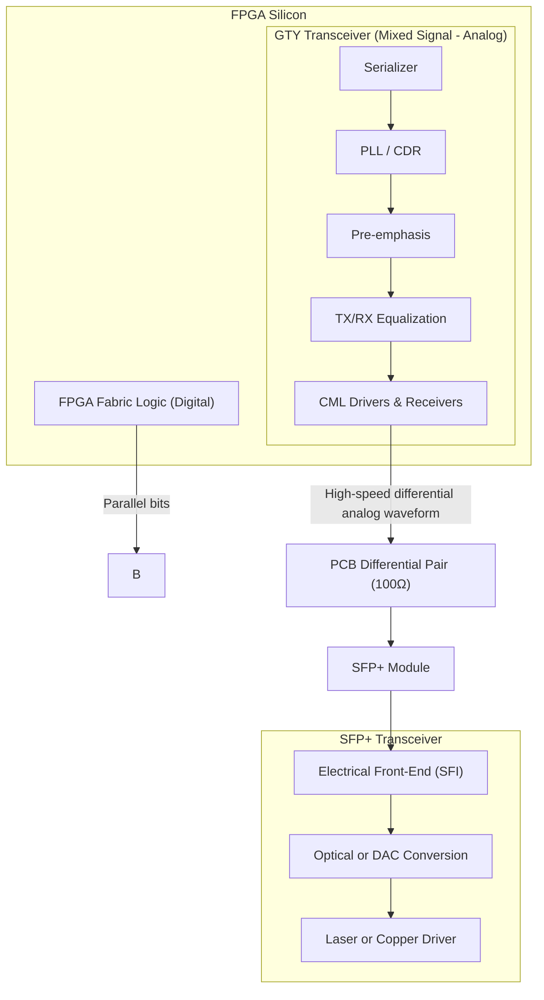

```mermaid
flowchart TB
    A["FPGA Fabric Logic (Digital)"] -->|Parallel bits| B

    subgraph FPGA["FPGA Silicon"]
        A
        subgraph GTY["GTY Transceiver (Mixed Signal - Analog)"]
            B1["Serializer"]
            B2["PLL / CDR"]
            B3["Pre-emphasis"]
            B4["TX/RX Equalization"]
            B5["CML Drivers & Receivers"]

            B1 --> B2 --> B3 --> B4 --> B5
        end
    end

    B5 -->|High-speed differential analog waveform| C["PCB Differential Pair (100Ω)"]

    C --> D["SFP+ Module"]

    subgraph SFP["SFP+ Transceiver"]
        D1["Electrical Front-End (SFI)"]
        D2["Optical or DAC Conversion"]
        D3["Laser or Copper Driver"]

        D1 --> D2 --> D3
    end

    D --> D1
```
