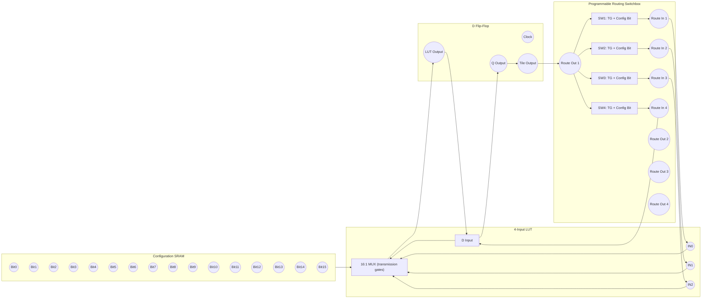

Perfect — let’s make a **conceptual CMOS FPGA tile schematic** in **Mermaid** syntax so you can visualize how the transistor-level building blocks connect.

This is not transistor-by-transistor (that would be hundreds of MOSFETs) — instead it shows **logic-level hierarchy** for a single *4-input LUT + D flip-flop + routing switchbox* tile.

---

### 🧩 FPGA Tile Schematic (Mermaid Diagram)

---

### 🔍 Explanation of the Diagram

| Block                  | Function                                       | Built From                                              |
| ---------------------- | ---------------------------------------------- | ------------------------------------------------------- |
| **Configuration SRAM** | Stores LUT bits and routing enable bits        | 6T CMOS cells (each = 2 inverters + 2 pass transistors) |
| **4-Input LUT**        | Selects one of 16 config bits using inputs A–D | Tree of 2:1 transmission-gate MUXes                     |
| **D Flip-Flop**        | Registers the LUT output on clock edge         | Master–slave pair of gated latches                      |
| **Switchbox**          | Allows programmable connections between tiles  | Transmission gates + config SRAM bits                   |

---

### 🧠 Implementation Tips

* Each **transmission gate (TG)** = 1 NMOS + 1 PMOS controlled by config bit and its complement.
* Each **SRAM bit** can be emulated initially using DIP switches or 74HC595 shift registers to avoid wiring 6T cells by hand.
* Start small: try making a **2-input LUT (4 bits)** before a 4-input one.

