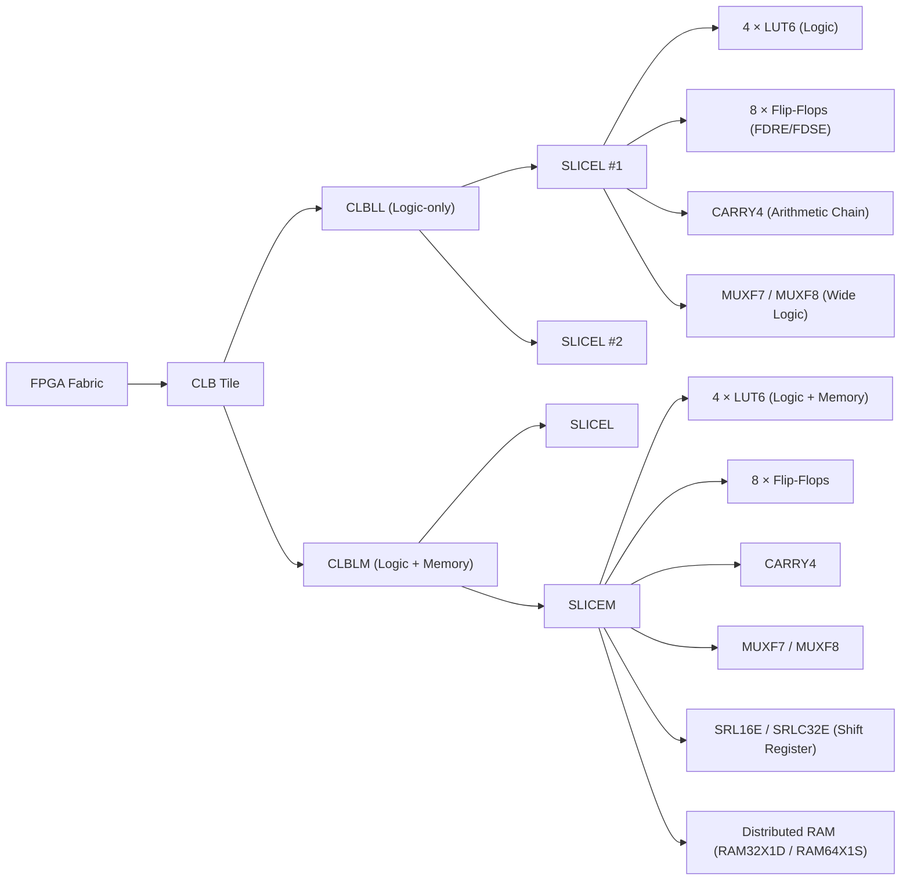

# **Configurable Logic Block (CLB)**

The **Configurable Logic Block (CLB)** structure for **Xilinx 7-series FPGAs** (Artix-7, Kintex-7, Virtex-7, Zynq-7000).

When you say “list of the CLBs,” that can mean one of two things:

1. **List of CLB *types*** — what variants exist in the architecture (e.g., logic-only vs. memory-capable).
2. **List of CLB *contents*** — what logic primitives are inside each CLB.

Let’s cover **both**, since they’re tightly related.

---

## 🧩 1. CLB Types in 7-Series

Each **CLB** contains **two slices**, and each slice can be one of two types:

| Slice Type | Also called    | Functionality                                    | LUT Features                                            |
| ---------- | -------------- | ------------------------------------------------ | ------------------------------------------------------- |
| **SLICEL** | “Logic Slice”  | General-purpose logic                            | LUTs used for logic only                                |
| **SLICEM** | “Memory Slice” | Logic + small distributed RAM or shift registers | LUTs can become **SRL16/SRLC32** or **distributed RAM** |

So:

* A **CLB** can be **(SLICEL + SLICEL)** or **(SLICEL + SLICEM)**, depending on the tile.
* The **distribution** of SLICEMs across the die is typically ~25% of all slices.

---

## 🧱 2. Internal Composition of a 7-Series CLB

Each **CLB** contains **two slices**, and each slice (CLD) has:

| Primitive                                             | Description                                               |
| ----------------------------------------------------- | --------------------------------------------------------- |
| **4 × LUT6**                                          | 6-input LUTs (can also be split into 8 × LUT5s)           |
| **8 × Flip-Flops (FDRE / FDSE / FDCE / FDPE)**        | Registers with optional reset, set, or enable             |
| **1 × CARRY4**                                        | Four-bit carry logic for arithmetic chaining              |
| **MUXF7 / MUXF8**                                     | Hierarchical LUT output multiplexers (build larger logic) |
| **SRL16E / SRLC32E** *(SLICEM only)*                  | Shift-register LUTs                                       |
| **RAM32X1D / RAM64X1S** *(SLICEM only)*               | Distributed RAM primitives                                |
| **Wide-function multiplexers and local interconnect** | Connect LUTs, FFs, and carry chains                       |

So one **CLB** =
→ 2 × Slices
→ 8 × LUT6
→ 16 × Flip-Flops
→ 2 × CARRY4
→ 2 × MUXF7
→ 1 × MUXF8

---

## 🗺️ 3. Example Naming Convention in Vivado

When you open the Device view:

| Vivado Tile Name | Slice Sites                    |
| ---------------- | ------------------------------ |
| `CLBLL_X10Y30`   | `SLICE_X20Y60`, `SLICE_X20Y61` |
| `CLBLM_X10Y31`   | `SLICE_X20Y62`, `SLICE_X20Y63` |

Where:

* `CLBLL` = CLB with **L**ogic slices (SLICELs)
* `CLBLM` = CLB with one or more **M**emory slices (SLICEMs)

---

## ⚙️ 4. Quick Hierarchy Overview (Text)

```
FPGA Fabric
 └── CLB Tile
      ├── CLBLM (Logic + Memory)
      │    ├── SLICEM (4 LUTs + 8 FFs + RAM/SRL)
      │    └── SLICEL (4 LUTs + 8 FFs)
      └── CLBLL (Logic only)
           ├── SLICEL (4 LUTs + 8 FFs)
           └── SLICEL (4 LUTs + 8 FFs)
```

---

## ✅ TL;DR — List of 7-Series CLB Variants

| CLB Type   | Slice Types             | Key Features                               |
| ---------- | ----------------------- | ------------------------------------------ |
| **CLBLL**  | 2 × SLICEL              | Pure logic                                 |
| **CLBLM**  | 1 × SLICEL + 1 × SLICEM | Logic + distributed RAM/SRL                |
| **SLICEL** | Logic slice             | LUT6, FF, carry, mux                       |
| **SLICEM** | Memory slice            | LUT6, FF, carry, mux, SRL, distributed RAM |

---


