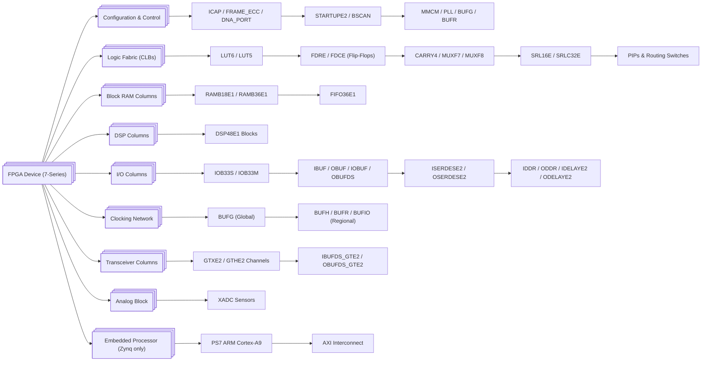

# FPGA Primitives

How the major **7-series FPGA primitives** are structured and connected inside the device fabric.

---

## 🧱 **Text Hierarchy Overview**

```
FPGA (7-Series)
│
├── Configuration & Control
│   ├── ICAP, FRAME_ECC, STARTUPE2, BSCAN, DNA_PORT
│   └── Clock Managers: MMCM, PLL, BUFG/BUFH/BUFR/BUFIO
│
├── Logic Fabric (CLB Columns)
│   ├── Slice (LUTs + FFs + Carry + MUXes)
│   │   ├── LUT6, LUT5, LUT3
│   │   ├── FDRE / FDCE (Flip-Flops)
│   │   ├── CARRY4
│   │   ├── MUXF7 / MUXF8
│   │   └── SRL16E / SRLC32E (Distributed RAM / Shift Reg)
│   └── Connected by Routing Switch Matrices (PIPs)
│
├── Memory Columns
│   ├── Block RAM Tiles
│   │   ├── RAMB18E1 / RAMB36E1
│   │   └── FIFO36E1
│   └── Optional BRAM controllers (soft AXI or native)
│
├── DSP Columns
│   └── DSP48E1 (MAC, multiplier, ALU, preadder)
│
├── I/O Columns
│   ├── IOB33S / IOB33M (Single-ended/Differential I/O)
│   ├── IBUF / OBUF / IOBUF / OBUFDS / IBUFDS
│   ├── ISERDESE2 / OSERDESE2 / IDDR / ODDR
│   └── IDELAYE2 / ODELAYE2
│
├── Clocking Network
│   ├── BUFGs (Global clock buffers)
│   ├── BUFH / BUFR / BUFIO (Regional / local)
│   └── Clock routing spine connects to every tile column
│
├── Transceiver Columns (optional, on high-end devices)
│   ├── GTXE2_CHANNEL / GTXE2_COMMON
│   ├── GTHE2_CHANNEL / GTHE2_COMMON
│   └── IBUFDS_GTE2 / OBUFDS_GTE2 (refclk interfaces)
│
├── Analog Block
│   └── XADC (on-chip ADC and sensors)
│
└── Embedded Processor (Zynq-7000 only)
    ├── PS7 (ARM Cortex-A9 dual-core)
    └── AXI interconnect bridges (PS↔PL)
```

---

## 🧭 **Mermaid Flowchart Representation**



---

## 💡 Summary

Think of the **7-series architecture** as a **columnar grid**:

* [**CLBs**](CLBs) (logic) form most of the fabric.
* **BRAMs**, **DSPs**, [**IOBs**](IOBs), and **GTXs** form vertical **columns** interleaved with CLBs.
* The **clocking network** and **routing matrices** interconnect everything.
* On **Zynq**, a **Processing System (PS7)** block connects via **AXI** to the programmable logic (PL).

