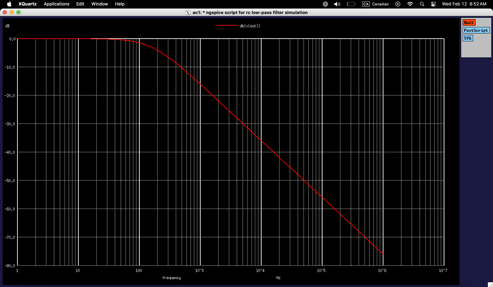

Here’s an example of an **NGSPICE script** for simulating a simple **RC low-pass filter**. This script demonstrates how to define components, set up a simulation, and plot the results.

---

### NGSPICE Script: RC Low-Pass Filter Simulation

```plaintext
* NGSPICE Script for RC Low-Pass Filter Simulation
* Define the circuit components

* Input voltage source (1V AC, frequency sweep)
V1 in 0 AC 1

* Resistor (1kΩ)
R1 in out 1k

* Capacitor (1µF)
C1 out 0 1u

* Simulation control
.control
  * Set up an AC analysis (frequency sweep from 1Hz to 1MHz, 10 points per decade)
  ac dec 10 1 1Meg

  * Run the simulation
  run

  * Plot the output voltage (magnitude in dB)
  plot db(v(out))

  * Optionally, plot the phase response
  * plot ph(v(out))
.endc

* End of script
.end
```

---

### Explanation of the Script

1. **Circuit Description**:
   - `V1 in 0 AC 1`: Defines an AC voltage source (`V1`) connected between node `in` and ground (`0`). The amplitude is 1V, and it will be used for an AC analysis.
   - `R1 in out 1k`: Defines a resistor (`R1`) with a value of 1kΩ, connected between nodes `in` and `out`.
   - `C1 out 0 1u`: Defines a capacitor (`C1`) with a value of 1µF, connected between node `out` and ground.

2. **Simulation Control**:
   - `.control`: Starts the control section, where simulation commands are given.
   - `ac dec 10 1 1Meg`: Sets up an AC analysis with a logarithmic frequency sweep from 1Hz to 1MHz, with 10 points per decade.
   - `run`: Executes the simulation.
   - `plot db(v(out))`: Plots the magnitude of the output voltage (`v(out)`) in decibels (dB).
   - Optionally, you can plot the phase response using `plot ph(v(out))`.

3. **End of Script**:
   - `.endc`: Ends the control section.
   - `.end`: Marks the end of the script.

---

### Running the Script

1. Save the script to a file, e.g., `rc_filter.cir`.
2. Run NGSPICE and load the script:
   ```bash
   ngspice rc_filter.cir
   ```
3. NGSPICE will execute the script, perform the AC analysis, and display the plot of the output voltage magnitude.

---

### Expected Output
- The plot will show the frequency response of the RC low-pass filter.
- At low frequencies, the output voltage will be close to the input voltage (0 dB attenuation).
- At high frequencies, the output voltage will decrease, showing the filter’s cutoff frequency (around $f_c = \frac{1}{2\pi RC} \approx 159 Hz$).



---

This is a basic example, but NGSPICE can handle much more complex circuits and analyses. Let me know if you'd like to explore more advanced examples!
