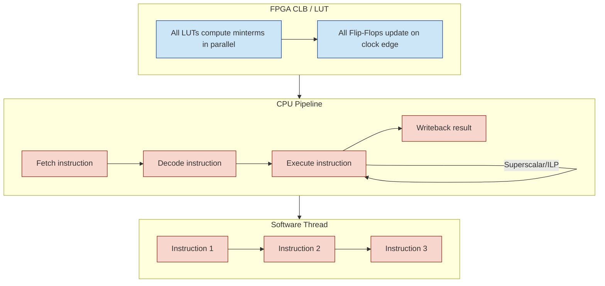

 </img>

```mermaid
graph TD
    subgraph CLB [FPGA CLB / LUT]
        LUTs[All LUTs compute minterms in parallel]
        FFs[All Flip-Flops update on clock edge]
        LUTs --> FFs
    end

    subgraph CPU [CPU Pipeline]
        Fetch[Fetch instruction]
        Decode[Decode instruction]
        Execute[Execute instruction]
        Writeback[Writeback result]
        Fetch --> Decode --> Execute --> Writeback
        Execute -->|Superscalar/ILP| Execute
    end

    subgraph SW [Software Thread]
        Instr1[Instruction 1]
        Instr2[Instruction 2]
        Instr3[Instruction 3]
        Instr1 --> Instr2 --> Instr3
    end

    CLB --> CPU
    CPU --> SW

    classDef parallel fill:#cde6f7,stroke:#0b3d91,stroke-width:1px;
    classDef sequential fill:#f7d6cd,stroke:#911c0b,stroke-width:1px;

    class LUTs,FFs parallel;
    class Fetch,Decode,Execute,Writeback sequential;
    class Instr1,Instr2,Instr3 sequential;
```
