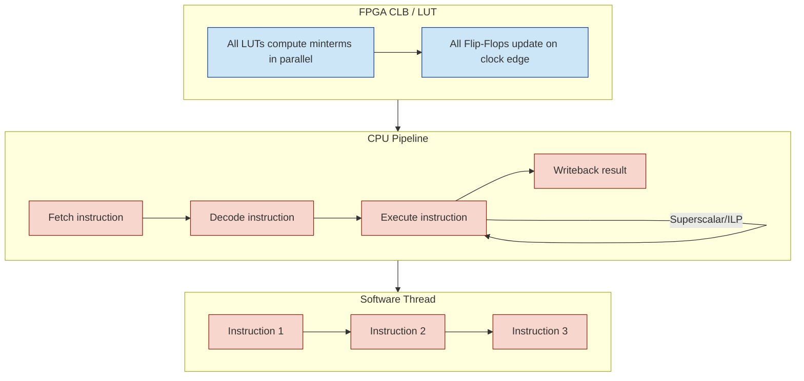

**Deep architecture question**: CPUs are fundamentally made from digital logic (which could, in theory, be massively parallel), yet they behave mostly as **sequential processors**. Let’s unpack this carefully.

---

## 1. Digital Systems Are Fundamentally Parallel

At the transistor and gate level:

* Every combinational logic block can, in theory, compute **all outputs simultaneously**.
* Flip-flops can update their state **all at once on a clock edge**.
* In an FPGA or ASIC, you can literally run hundreds of millions of operations “in parallel.”

**Example:** a LUT in a CLB evaluates all minterms at once — purely parallel.

---

## 2. Why CPUs Still Behave Sequentially

Despite underlying parallelism, CPUs are **sequential by design** at the instruction level.

### 2.1 Von Neumann Architecture

* Fetch → Decode → Execute → Writeback (pipeline stages)
* Instructions **depend on previous instructions** (data hazards, control flow)
* CPU pipeline enforces a sequential program order, even if some stages overlap

### 2.2 Data Dependencies

* Instruction B might need the result of instruction A.
* No matter how parallel the logic gates are, the CPU **cannot compute B before A** is finished.
* This is **sequential dependency**, not hardware limitation.

---

### 2.3 Limited Hardware Resources

* ALUs, FPUs, load/store units, branch predictors are **finite**
* Even if you could do 100 operations in parallel, most instructions must **share execution units**.
* Multithreading or superscalar execution tries to exploit parallelism, but it’s bounded.

---

### 2.4 Memory Bottlenecks

* Parallel logic is only useful if **data is available**
* Memory latency is orders of magnitude higher than gate delay
* This forces the CPU to **serialize memory-dependent instructions**

---

## 3. Where CPUs Actually Exploit Parallelism

CPUs are not completely sequential — they use many forms of parallelism:

1. **Instruction-Level Parallelism (ILP)**

   * Out-of-order execution
   * Multiple instructions executed simultaneously when independent

2. **Superscalar Pipelines**

   * Multiple ALUs per CPU
   * Can execute multiple instructions per cycle

3. **SIMD / Vector Units**

   * Single instruction operates on multiple data elements
   * e.g., AVX instructions

4. **Multithreading / Hyperthreading**

   * Multiple software threads share CPU cores

But all these techniques are **carefully scheduled and bounded** — not unlimited parallelism like an FPGA.

---

## 4. Key Insight

> CPUs are digital systems **with massively parallel gates**, but they are designed to enforce **sequential program order** for correctness and general-purpose computation.

* Hardware is parallel
* Program semantics are sequential
* CPUs approximate parallelism **where safe and predictable**, not everywhere

---

## 5. Contrast With FPGAs / CLBs

* FPGA: you instantiate many parallel hardware blocks; each is **truly independent**
* CPU: you reuse ALUs / pipeline stages; instruction order enforces **virtual sequentiality**
* CPU parallelism is **implicit**, constrained, and scheduled
* FPGA parallelism is **explicit**, unlimited (hardware permitting)

---

### 🔹 Example Visualization

| Hardware Level | Parallelism                              | Sequential Constraint            |
| -------------- | ---------------------------------------- | -------------------------------- |
| CLB / LUT      | All minterms compute at once             | None                             |
| Flip-Flop      | All clocked in parallel                  | Updates on clock edge            |
| CPU ALU        | Can do multiple operations (superscalar) | Instruction order + dependencies |
| Program code   | Conceptually sequential                  | Sequential execution             |

---

## 6. Summary

1. **CPUs are built from parallel digital systems**

2. **Sequential behavior emerges** from:

   * Instruction dependencies
   * Memory access delays
   * Finite execution resources
   * Need to preserve program semantics

3. **Parallelism exists** but is constrained (ILP, SIMD, multithreading)

4. **FPGAs / ASICs**: you can exploit **massive, explicit parallelism** without violating correctness because hardware is designed for it.

---

 </img>

