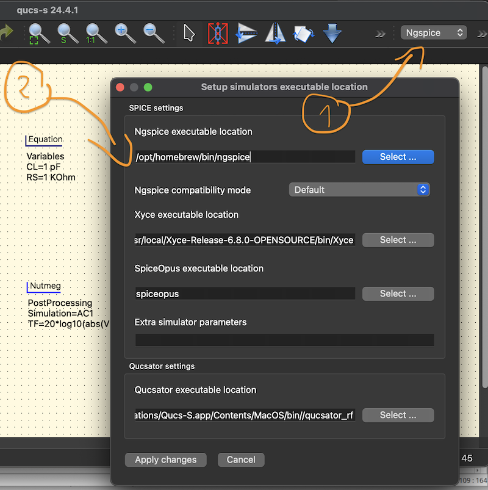

# QUCS-S with NGSPICE

## :a: Selecting NGSPICE simulation Engine

- [ ] 1) Select `ngspice` engine
- [ ] 2) Set the binary in `Simulators Settings` 



## :b: Install [ngspice](https://ngspice.sourceforge.io/)

```
brew install ngspice
```
> Returns
```powershell
Warning: ngspice 44.2 is already installed and up-to-date.
To reinstall 44.2, run:
  brew reinstall ngspice
```

## :o: Install QUCS-S on Mac :apple:

- [ ] Install using homebrew

```
brew tap ra3xdh/qucs-s && brew install qucs-s
```

- [ ] Run from Command Line

```
/Applications/Qucs-S.app
```

# References
