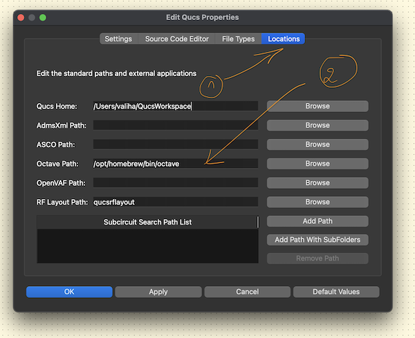

# Octave Integration


## :a: Install On Mac :apple:

```
brew install octave
```
> Returns
```powershell
==> Auto-updating Homebrew...
...
You have 44 outdated formulae and 12 outdated casks installed.


The 4.4.21 changelog can be found at:
  https://github.com/Homebrew/brew/releases/tag/4.4.21
Warning: octave 9.4.0 is already installed and up-to-date.
To reinstall 9.4.0, run:
  brew reinstall octave
```

## :b: Setup in QUCS-S

> File > Application Settings


