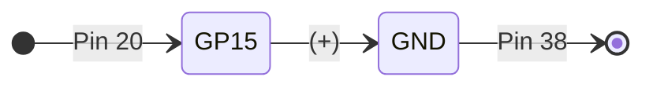

- [ ] [Getting started with Raspberry Pi Pico](https://projects.raspberrypi.org/en/projects/getting-started-with-the-pico)

- [ ] [Blink the onboard LED](https://projects.raspberrypi.org/en/projects/getting-started-with-the-pico/5)




```python
from machine import Pin
led = Pin(25, Pin.OUT)

led.toggle()
```

 </img>

- [ ] [Use digital inputs and outputs](https://projects.raspberrypi.org/en/projects/getting-started-with-the-pico/6)

```python
from machine import Pin, Timer
led = Pin(15, Pin.OUT)
timer = Timer()

def blink(timer):
    led.toggle()

timer.init(freq=2.5, mode=Timer.PERIODIC, callback=blink)
```

 </img>

```python
from machine import Pin
import time

led = Pin(15, Pin.OUT)
button = Pin(14, Pin.IN, Pin.PULL_DOWN)

while True:
    if button.value():
        led.toggle()
        time.sleep(0.5)
```

 </img>

