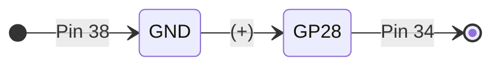

- [ ] [How to Set Up and Program Raspberry Pi Pico W, Pico](https://www.tomshardware.com/how-to/raspberry-pi-pico-setup)

```python
from machine import Pin
import utime

led = Pin(28, Pin.OUT)
led.low()

while True:
   led.toggle()
   print("Toggle")
   utime.sleep(1)
```



 </img>

# References

- [ ] [Getting started with Raspberry Pi Pico](https://projects.raspberrypi.org/en/projects/getting-started-with-the-pico)
